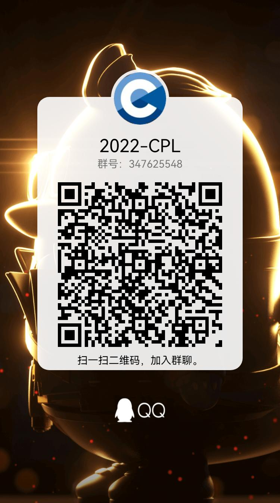
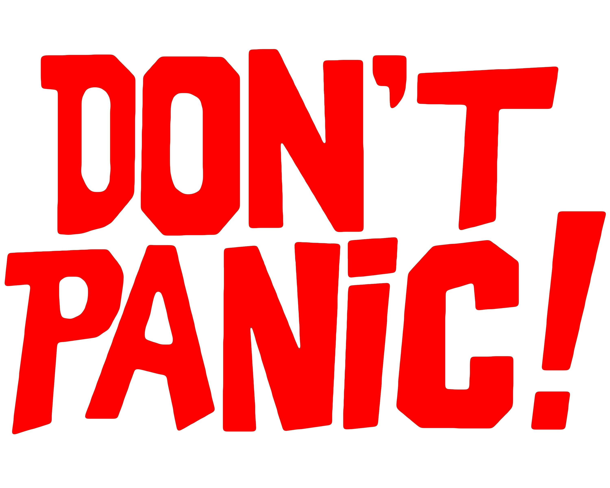
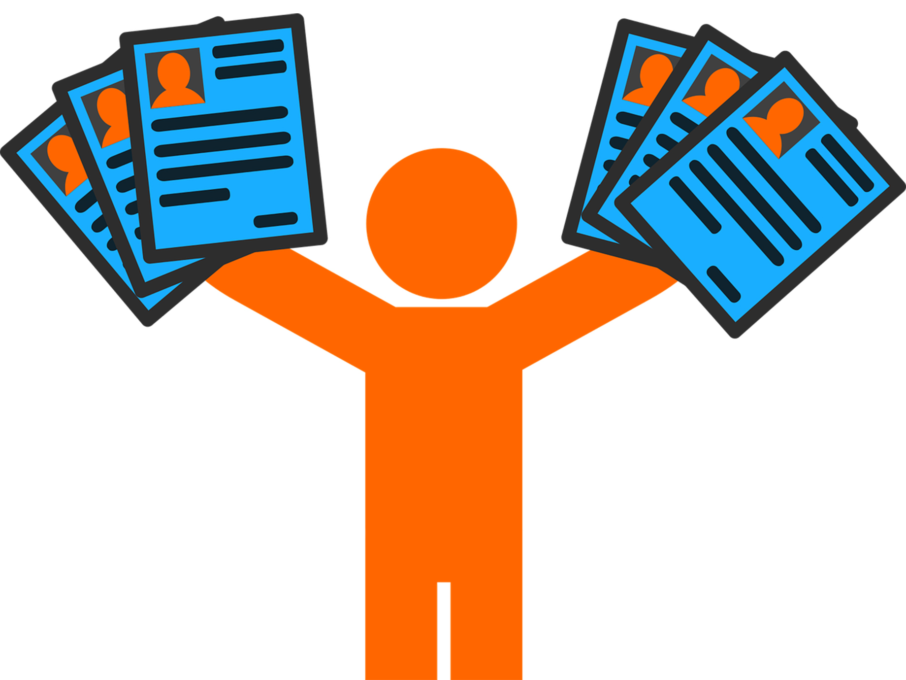
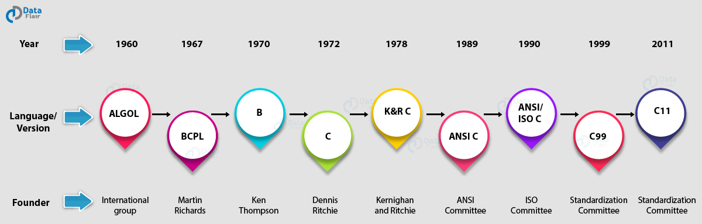
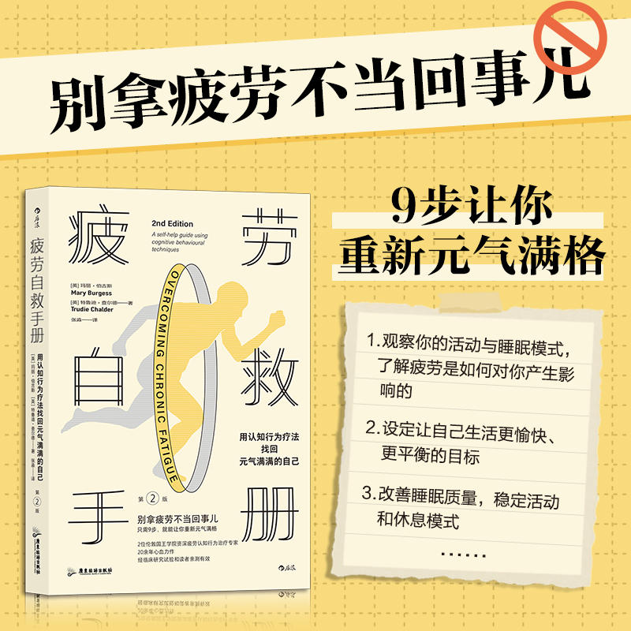
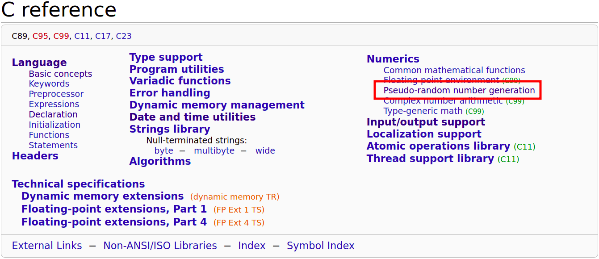

# Introducing C

 

[Hengfeng Wei (魏恒峰)](https://hengxin.github.io/)
hfwei@nju.edu.cn

---

---
# Questionnaire

$75\%$ of students are new to programming.

---
# To C Beginners

 

---
# From Beginners to Masters

 

## Programming

## De-Programming

---
# Scores

* ~~考勤~~
* ~~期中测试~~
* ~~期末笔试~~
* 编程练习 ($40$ 分)
* 期中项目 ($20$ 分)
* 期末项目 ($10$ 分)
* 期末机试 ($30$ 分)

---
# No Plagiarism!!!

 

前两次<mark>总评</mark>各扣 $10$ 分, 第三次直接判为不及格

---

---

# K&R C Bible (1978; 1988)

  

<!-- #### Not for Beginners -->

---
# A Brief History of C

You do *NOT* have to become a **language lawyer**.

---

---

---

---

<!-- ---

 -->

---

---

---
# [Game: Guess the Number](https://www.abcya.com/games/guess_the_number)

---
# [Game: Guess the Number](https://www.abcya.com/games/guess_the_number)

 

Programming is *NOT* (only) about languages.

You learn C to express **YOUR IDEAS** with **COMPUTERS**.

---
# [Game: Guess the Number](https://www.abcya.com/games/guess_the_number)

 

**Program = Input + Data + Operations + Output**

---
# [c reference](https://en.cppreference.com/w/c)

---

---

---