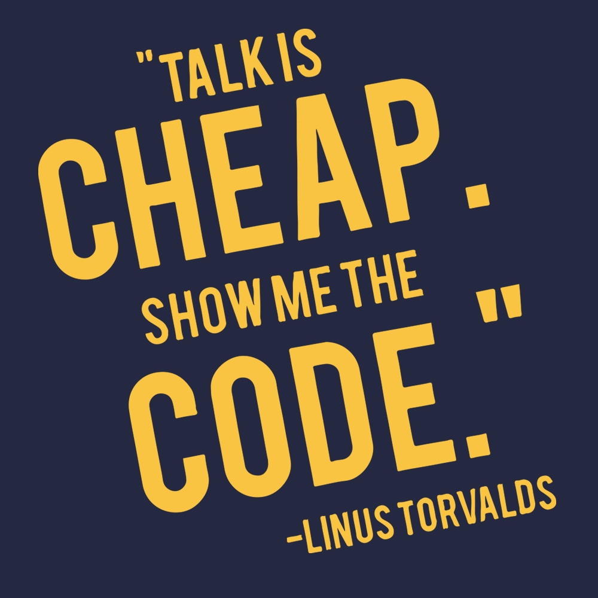

# Introducing C

 

[Hengfeng Wei (魏恒峰)](https://hengxin.github.io/)
hfwei@nju.edu.cn

---

---
# Questionnaire

$75\%$ of students are new to programming.

---
# To C Beginners

 

---
# From Beginners to Masters

 

## Programming

## De-Programming

---
# Scores

* ~~考勤~~
* ~~期中测试~~
* ~~期末笔试~~
* 编程练习 ($40$ 分)
* 期中项目 ($20$ 分)
* 期末项目 ($10$ 分)
* 期末机试 ($30$ 分)

---

---

 

  

<!-- #### Not for Beginners -->

---

---

---

---

---

---
# [Game: Guess the Number](https://www.abcya.com/games/guess_the_number)

---
# [c reference](https://en.cppreference.com/w/c)

---

---

---