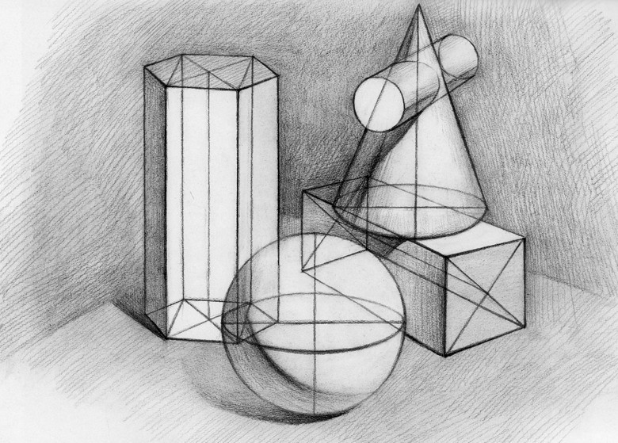

# 
11. &nbsp; Struct 

[Hengfeng Wei (魏恒峰)](https://hengxin.github.io/)
hfwei@nju.edu.cn

Dec. 09, 2022

---
# Review
 

### <mark>Pointer Arrays</mark>
### <mark>Pointers and 2D Arrays</mark>
### <mark>Function Pointers</mark>

---
# Overview

## <mark>Struct &emsp; ~~Union~~ &emsp; Enum</mark>

---

## <mark>musician.c</mark>

---

---

---

 

### For 罗大佑 only:
 

- 每组信息占一行
- 各项信息使用 `\t` 间隔
- 各项信息遵循特定格式要求
 
 

---
