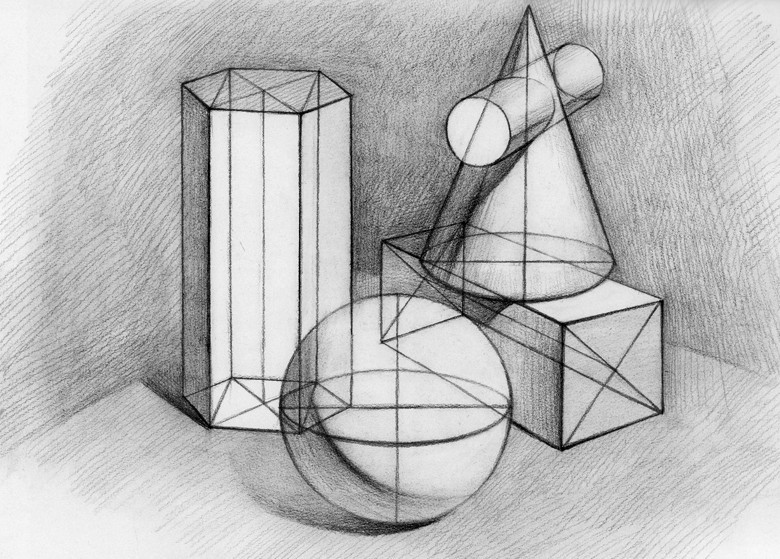
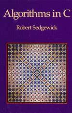
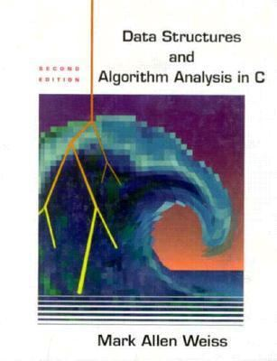

# 
12. &nbsp; Linked Lists 

[Hengfeng Wei (魏恒峰)](https://hengxin.github.io/)
hfwei@nju.edu.cn

Dec. 17, 2022

---
# Review

### <mark>Struct &emsp; ~~Union~~ &emsp; Enum</mark>

---
# Overview
 
 

## <mark>Linked List</mark>

---
 

## <mark>Singly Linked List</mark>

 

## <mark>Doubly Linked List</mark>

---
 
 
 

## <mark>Circular (Singly) Linked List</mark>

---

## <mark>josephus.c</mark>

---

## ``十步杀一人, 千里不留行''

---

## $J(2^m + l) = 2l + 1 \quad {\small (m \ge 0 \land 0 \le l < 2^m)}$

---

---
