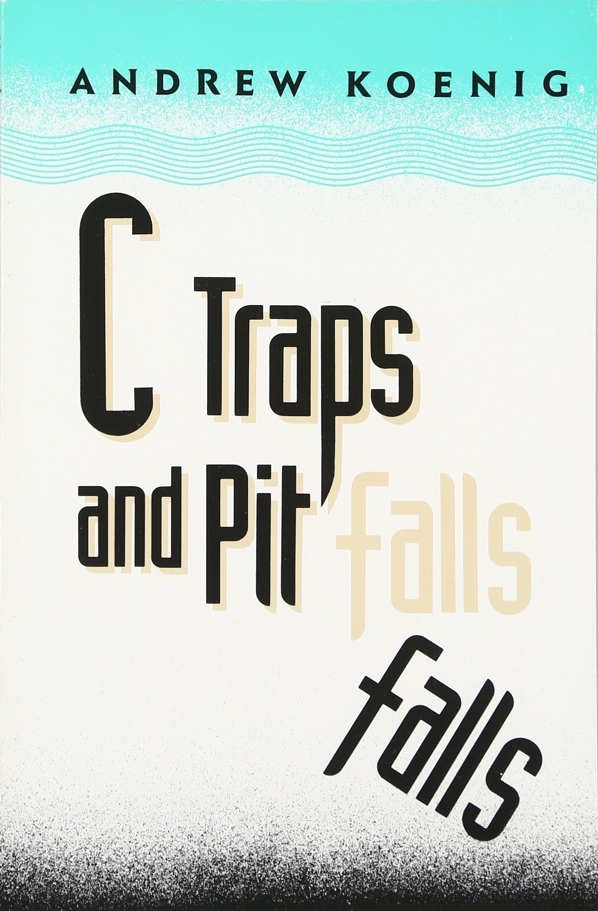

<!-- # 
13. &nbsp; Epilogue 

[Hengfeng Wei (魏恒峰)](https://hengxin.github.io/)
hfwei@nju.edu.cn -->

<!-- Dec. 21, 2022 -->

---

---
 
 

## <mark>switch/case</mark> (Section 5.3)
 

## <mark>continue</mark> (Section 6.4.2)
 

## <mark>goto</mark> (Section 6.4.3)

---
 
 

## <mark>Macro (宏)</mark> (Chapter 14)
 

## <mark>Bit Manipulation</mark> (Chapter 20)
 

## <mark>File Operations</mark> (Section 22.2)

---

<!--  -->

---

---

---
  

---
 &emsp; &emsp; 

---

---

---

---

---

---

## 有请知名 UP 主 [AUGPath @ bilibili](https://space.bilibili.com/13246364?spm_id_from=333.337.search-card.all.click)

---
 &emsp; 

---

---
