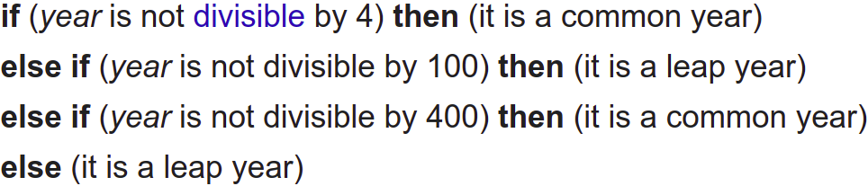

# 
2. &nbsp; If, For, Array

[Hengfeng Wei (魏恒峰)](https://hengxin.github.io/)
hfwei@nju.edu.cn

Oct. 07, 2022

---
# Feedback

---
 
 
 

# 好原料 + 好工艺 = 好产品

---
# Review

### Variables (变量) &emsp; Data Types (数据类型)

 

### Operators (运算符) &emsp; Expressions (表达式)
### Assignment Statements (赋值语句)

 

### I/O (Input/Output; 输入输出)

---
# Overview
 

### If Statement (`if` 语句)
### For Statement (`for` 语句)
### Logical Expressions (逻辑表达式)
 

### Array (数组)
---

## <mark>min.c &ensp; leap.c &ensp; sum.c &ensp; min.c</mark>

---
# Min

---
# Min of Two
 

Given two integers $a$ and $b$, to compute their minimum.
 

$min = \min\{a, b\}$

---
# Min of Two

fig of code: relational operator, relational expression

---
# Min of Two
 

## <code>min = a >= b ? b : a;</code>
 

# Do Not Use it Too Much!

---
# Min of Two
 

Given two doubles $a$ and $b$, to compute their minimum.
 

$\mathit{min} = \min\{a, b\}$

---
# Min of Three
 

Given three integers $a$, $b$, and $c$, to compute their minimum.
 

$\mathit{min} = \min\{a, b, c\}$

---
# Min of Three
 

nested vs. flatten

&&, ||

---
# Min of a Set of Numbers
 

Given a set $A$ of integers, to compute their minimum.

$\mathit{min} = \min A$
 

---
# Leap Year

---
# Leap Year (1): Nested `if/else`

---
# Leap Year (2): Nested `if/else`
 

---
# Leap Year (3): `else if`

---
# Leap Year (4): The Ultimate Version
 

A year is a <mark>**leap year**</mark> if
 

- it is divisible by $4$ but not by $100$,
- except that years divisible by $400$ are leap years.

---
# Leap Year (4): The Ultimate Version
 

---
# Short-circuit Evaluation

* year = 25
* year = 80

---
# Sum

Given an integer $n \ge 0$, to compute $\sum\limits_{i = 1}^{n} i$.

---
