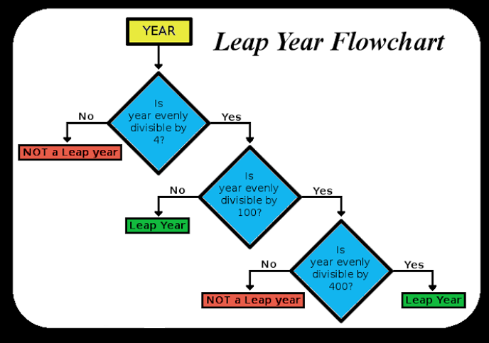

# 
2. &nbsp; If, For, Array

[Hengfeng Wei (魏恒峰)](https://hengxin.github.io/)
hfwei@nju.edu.cn

Oct. 07, 2022

<!-- ---
# Feedback -->

---
 
 
 
 

# <!--fit--> 好原料 + 好工艺 = 好产品

---
# Review

### Variables (变量) &emsp; Data Types (数据类型)

 

### Operators (运算符) &emsp; Expressions (表达式)
### Assignment Statements (赋值语句)

 

### I/O (Input/Output; 输入输出)

---
# Overview
 

### If Statement (`if` 语句)
### For Statement (`for` 语句)
### Logical Expressions (逻辑表达式)

 

### Array (数组)
---

## <mark>min.c &ensp; leap.c &ensp; min-array.c</mark>

---
# Min

---
# Min of Two
 

Given two integers $a$ and $b$, to compute their minimum.
 

$min = \min\{a, b\}$

---
# Min of Two

fig of code: relational operator, relational expression

---
# Min of Two
 

## <code>min = a >= b ? b : a;</code>
 

# Do Not Use it Too Much!

---
# Min of Two
 

Given two doubles $a$ and $b$, to compute their minimum.
 

$\mathit{min} = \min\{a, b\}$

---
# Min of Three
 

Given three integers $a$, $b$, and $c$, to compute their minimum.
 

$\mathit{min} = \min\{a, b, c\}$

---
# Min of Three
 

nested vs. flatten

&&, ||

---
# Min of a Set of Numbers
 

Given a set $A$ of integers, to compute their minimum.

$\mathit{min} = \min A$
 

---
# Leap Year

---
# Leap Year (1): Nested `if/else`

---
# Leap Year (2): Nested `if/else`
 

---
# Leap Year (3): `else if`

---
# Leap Year (4): The Ultimate Version
 

A year is a <mark>**leap year**</mark> if
 

- it is divisible by $4$ but not by $100$,
- except that years divisible by $400$ are leap years.

---
# Leap Year (4): The Ultimate Version
 

---
# Short-circuit Evaluation

* year = 25
* year = 80

---
<!-- # Sum

Given an integer $n \ge 0$, to compute $\sum\limits_{i = 1}^{n} i$.

$\sum\limits_{i=1}^{n} = \frac{n(n-1)}{2}$

 -->

---
# Min of a Set of Numbers
 

Given a set $A$ of integers, to compute their minimum.
 

$\mathit{min} = \min_{i} A_{i}$

---
# `For` Statement
 

 

---
# <!--fit--> Increment/Decrement Operators (`++`, `--`)
 
 
 

    i = 2;
    j = i * i++;

---
# [Undefined Behavior (UB)](https://en.cppreference.com/w/c/language/behavior)

## Avoid UBs!!!

---

 
 

It is <ins>up to you</ins> to ensure that the type of the actual argument <ins>matches</ins> the type expected by conversion specifiers.

---
# <code>#define NUM 5</code>
 

### Symbolic Constants (符号常量)
 

## <code>int numbers[NUM] = {0};</code> has a <mark>*constant*</mark> size.
 

## `NUM` is known at <mark>*compiler*</mark> time.

---
# Array Initializer
 

* <code>int numbers[NUM] = {1};</code>
 

* <code>int numbers[] = {0};</code>
 

* <code>int numbers[NUM] = {[2] = 1};</code>

---
# Array Initializer (DON'T)
 

<code>int numbers[NUM] = {};</code>
 

## Forbidden in C99 (Unfortunately!)
## Allowed by GCC by default (Unfortunately!!)

---
# Array Initializer (DON'T)
 

<code>int numbers[NUM];</code>
 

## `numbers` may contain garbage values;
## always initialize it

---
# Array Initializer (DON'T)
 

<code>int numbers[];</code>
 

## You <mark>must</mark> specify the size so that the compiler/runtime can allocate memory for it.

---
# Min of a Set of <mark>Input</mark> Numbers
 

<mark>**Input**</mark> a set $A$ of <mark>**$n \ge 1$**</mark> integers, to compute their minimum.
 

$\mathit{min} = \min_{i} A_{i}$

---
