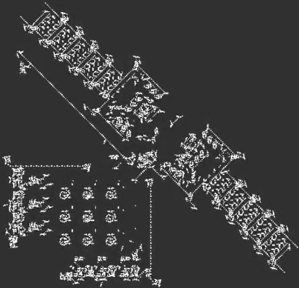

# 
4. &nbsp; Loops

[Hengfeng Wei (魏恒峰)](https://hengxin.github.io/)
hfwei@nju.edu.cn

Oct. 21, 2022

---
# Review
 

### For Statement (More Examples)
 

### While (Do-While) Statement
 

### `break` Statement

---
# Overview
 
 

### Loops (More Examples)
 

### Multidimensional Arrays (多维数组)

---

## <mark>game-of-life.c &ensp; merge.c &ensp; <del>bubble-sort.c</del></mark>

---
# [Conway's Game of Life @ wiki](https://en.wikipedia.org/wiki/Conway%27s_Game_of_Life)

#### John Horton Conway ($1937 \sim 2020$)

#### [playgameoflife.com (Cellular Automata; 元胞自动机)](https://playgameoflife.com/)
---
# [Conway's Game of Life @ wiki](https://en.wikipedia.org/wiki/Conway%27s_Game_of_Life)
 

* Any **live** cell with two or three live neighbours survives.
* All other **live** cells die in the next generation.
 

* Any **dead** cell with three live neighbours becomes a live cell.
* All other **dead** cells stay dead.

---
<!--  -->
<video control width = "950"> <source src="videos/Conway-Game-of-Life.mp4" type = "video/mp4"> </video>

## <mark>game-of-life.c</mark>

---
# Merge (<mark>merge.c</mark>)

---
# Bubble Sort (<mark>bubble-sort.c</mark>)

---
# Bubble Sort (<mark>bubble-sort.c</mark>)

---
