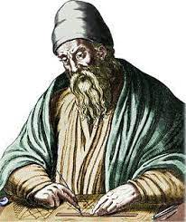

# 
6. &nbsp; Recursion

[Hengfeng Wei (魏恒峰)](https://hengxin.github.io/)
hfwei@nju.edu.cn

Nov. 04, 2022

---
# Review

# Functions

### Function Definition
### Function Declaration
### <mark>Arrays as Parameters</mark>
### <mark>Pass by Value</mark>

---
# Overview

### Recursive Functions (Recursion)

### A function that calls itself.

---
# <mark>Thinking Recursively</mark>

#### Solving a task by first solving its smaller subtasks

#### It will be a loooong way to go to master recursion!!!

---
# <mark>Thinking Recursively</mark>

You want to solve a task and suppose you have the <mark>Mirror</mark>.

### <mark>Ask the Mirror Right Questions</mark>

---
# <mark>Thinking Recursively</mark>
 
 

* What is a smaller task? &ensp; ($\star\star\star\star\star$)

* How to solve the task given the solution to the smaller one? ($\star\star\star$)

* What is the smallest task?&ensp; ($\star$)

---

# <mark>Thinking like a Computer</mark>

## <mark>min.c</mark>

---

## <mark>min-re.c &ensp; sum-re.c &ensp; fib-re.c &ensp; gcd-re.c &ensp; bsearch-re.c &ensp; <del>mergesort.c</del></mark>

---
# Min (<mark>min-re.c</mark>)

### <mark>Ask the Mirror Right Questions</mark>

---
# Min (<mark>min-re.c</mark>)

---
# Sum (<mark>sum-re.c</mark>)

### <mark>Ask the Mirror Right Questions</mark>

---
# Sum (<mark>sum-re.c</mark>)

---
# Fibonacci Sequence (<mark>fib-re.c</mark>)
 

$F_{0} = 1$

$F_{1} = 1$

$F_{n} = F_{n-1} + F_{n-2} \quad (n > 1)$

<!--  -->

---
# Greatest Common Divisor (<mark>gcd-re.c</mark>)

$\text{gcd}(a, b) = \text{gcd}(b, a \;\%\; b)$

---
# Binary Search (<mark>bsearch-re.c</mark>)

You should do sth. first to obtain the smaller task.

---
# MergeSort (<mark>mergesort.c</mark>)

---
# MergeSort (<mark>mergesort.c</mark>)

---
