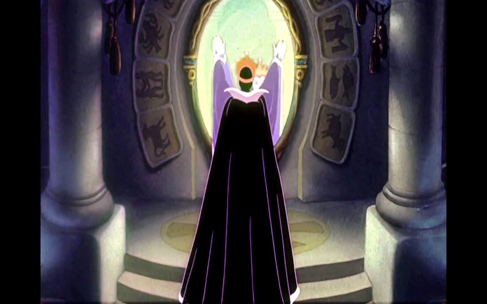

# 
6. &nbsp; Recursion

[Hengfeng Wei (魏恒峰)](https://hengxin.github.io/)
hfwei@nju.edu.cn

Nov. 04, 2022

---
# Review

# Functions

### Function Definition
### Function Declaration
### Arrays as Parameters
### <mark>Pass by Value</mark>

---
# Overview

### Recursive Functions (Recursion)

### A function that calls itself.

---

<mark>Thinking Recursively</mark>

### It is a looooooog way to go to master recursion!!!

---
You want to solve a task and suppose you have the <mark>Mirror</mark>.

* What is a smaller task?
* How to solve the task given the solution to the smaller one?
* What is the smallest task?

---

## <mark>min-re.c &ensp; sum-re.c &ensp; fib-re.c &ensp; gcd-re.c &ensp; bsearch-re.c</mark>

---
# Min (<mark>min-re.c</mark>)

---
# Sum (<mark>sum-re.c</mark>)

---
# Fibonacci Sequence (<mark>fib-re.c</mark>)

<!--  -->

---
# Greatest Common Divisor (<mark>gcd-re.c</mark>)

$\text{gcd}(a, b) = \text{gcd}(b, a \;\%\; b)$

---
# Binary Search (<mark>bsearch-re.c</mark>)

---
