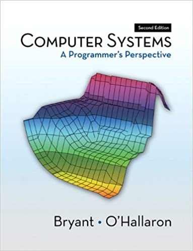

# 
7. &nbsp; Recursion; Data Types

[Hengfeng Wei (魏恒峰)](https://hengxin.github.io/)
hfwei@nju.edu.cn

Nov. 11, 2022

---
# Review

### Recursive Functions (Recursion)

### A function that calls itself.

---
# Overview
 

### Recursion (<mark>mergesort.c</mark>)
 

### Data Types

---

## <mark>mergesort.c</mark>

---
# Merge Sort (<mark>mergesort.c</mark>)

---
<!-- # Merge Sort (<mark>mergesort.c</mark>) -->

## DO YOU WANNA DANCE TONIGHT?

<!--  -->

---
# Data Types

The <mark>**type**</mark> of a variable determines

- the set of **values** it may take on and

- what **operations** can be performed on them.

---
 
 

## <mark>int &ensp;&ensp; double &ensp;&ensp; char &ensp;&ensp; bool</mark>
 

## <mark>[ ]</mark>

---

---
# Integral Types (<mark>int-limits.c</mark>)
 

- short (int)
- int
- long (int)
- long long (int)

<mark>signed</mark> *vs.* <mark>unsigned</mark>

---
# Overflow (<mark>int-overflow.c</mark>)
 

- 有符号整数运算中发生溢出, 程序的行为是**未定义的**。
 

- 无符号整数运算中发生溢出, 则发生**回绕**现象。

---
# Signed and Unsigned (<mark>unsigned.c</mark>)
 
 

### <mark>Be careful when mixing signed and unsigned types.</mark>
 

---
# Signed and Unsigned (<mark>unsigned.c</mark>)
 
 

### <mark>Do NOT use unsigned types unless you know exactly what you are doing.</mark>

---
# typedef
 
 

### <mark>typedef unsigned long long int size_t</mark>
 

### <mark>typedef long clock_t</mark>

---
# char (<mark>char.c</mark>)
 

### Use `char` only for representing characters.
 

### Do NOT assume `signed char` or `unsigned char`.

---
# Implicit Conversion
### (<mark>implicit-conversion.c</mark>)
 

- 算术表达式、逻辑表达式 (<mark>类型提升; Section 7.4.1</mark>)

- 定义初始化、赋值 (类型转换)

- 函数调用时 (类型转换)

- 函数返回时 (类型转换)
 

### Be careful about narrowing conversion!!!

---
# Explicit Conversion
### (<mark>explicit-conversion.c</mark>)

---
# Floating-point Numbers
### (<mark>float-limits.c</mark>)
 

- float (F)

- double

- long double (L)

---

### <mark>"Floating-point Arithmetic is Hard."</mark>
#### (Section 23.1 `float.h`)

---
### <mark>"Many applications don't need floating-point arithmetic at all."</mark>

### Use `math.h` (Section 23.3) whenever possible.

---

<mark>**sum-product.c &ensp; loop.c &ensp; compare.c**</mark>

---

---

---
