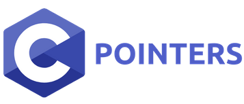

# 
9. &nbsp; Pointers and C Strings

[Hengfeng Wei (魏恒峰)](https://hengxin.github.io/)
hfwei@nju.edu.cn

Nov. 26, 2022

---
# Review

### <mark>Pointers and Arrays</mark>

---
# Overview
 

## <mark>Pointers and C Strings</mark>
## <mark>C String Arrays</mark>

---

## <mark>strlen.c &emsp; strcmp.c &emsp; strcpy.c &emsp; selection-sort-strings.c</mark>

---
