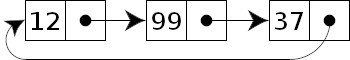
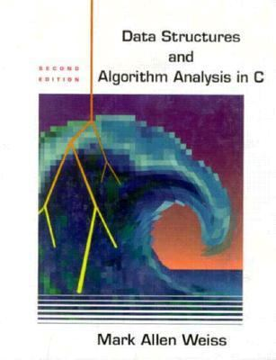
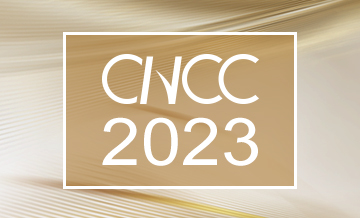

# 
13. &nbsp; Linked Lists 

[Hengfeng Wei (魏恒峰)](https://hengxin.github.io/)
hfwei@nju.edu.cn

Dec. 22, 2023

---
# Overview
 
 

## <mark>Linked List</mark>

---
 

## <mark>Singly Linked List</mark>

 

## <mark>Doubly Linked List</mark>

---
 
 
 

## <mark>Circular (Singly) Linked List</mark>

---

## <mark>josephus.c</mark>

---

## <mark>''I hate the Josephus Game!''</mark>

---

<!--  -->
 
 
 
 

## $J(2^m + l) = 2l + 1 \quad {\small (m \ge 0 \land 0 \le l < 2^m)}$

---

---

# <mark>我们不知道学生是如何学(~~不~~)会写代码的</mark>

---
