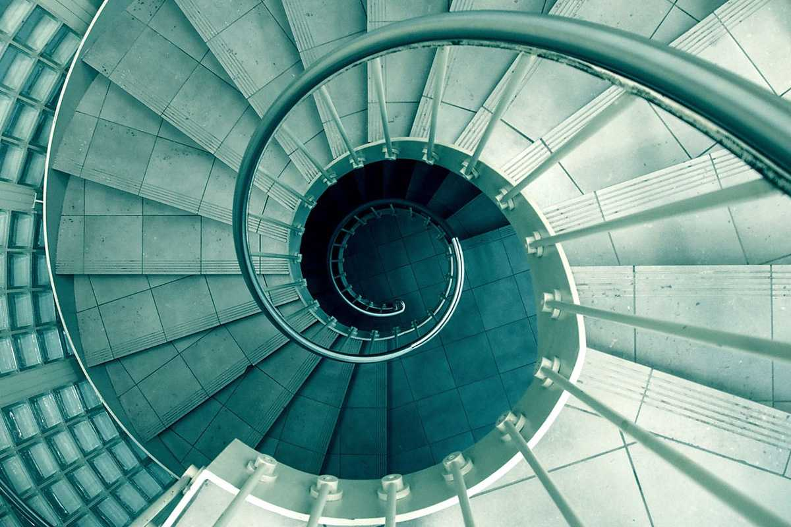

# 
6. &nbsp; Recursion

[Hengfeng Wei (魏恒峰)](https://hengxin.github.io/)
hfwei@nju.edu.cn

Nov. 10, 2023

---
# Review

# Functions

### Function Definition
### Function Declaration
### <mark>Arrays as Parameters</mark>
### <mark>Pass by Value</mark>

---
# Overview

### Recursive Functions (Recursion)

### A function that calls itself (<mark>main-re.c</mark>).

---
# <mark> (1) Thinking like a Computer Scientist </mark>

#### Solving a task by first solving its smaller subtasks

---
# <mark> (1) Thinking like a Computer Scientist </mark>

You want to solve a task and suppose you have the <mark>Mirror</mark>.

#### The <mark>Mirror</mark> can solve the smaller task for you magically.

---
# <mark> (1) Thinking like a Computer Scientist </mark>
 

* What is a smaller task? &ensp; ($\star\star\star\star\star$)
 

* How to reduce the original task into the smaller task? &ensp; ($\star\star\star$)
 

* How to solve the task given the solution to the smaller one? ($\star\star\star$)
 

* What is the smallest task?&ensp; ($\star$)

---
# <mark>Thinking Recursively</mark>

 
 
 

## <mark>It will be a loooooooooong way to go to master RECURSION!!!</mark>

---

# <mark> (2) Thinking like a Computer</mark>

## <mark>min.c</mark>

---

## <mark>min-re.c &ensp; sum-re.c &ensp; fib-re.c &ensp; gcd-re.c &ensp; bsearch-re.c &ensp; <del>mergesort.c</del></mark>

---
# Min (<mark>min-re.c</mark>)

---
# Min (<mark>min-re.c</mark>)

---
# Sum (<mark>sum-re.c</mark>)

---
# Sum (<mark>sum-re.c</mark>)

---
# Fibonacci Sequence (<mark>fib-re.c</mark>)
 

$F_{0} = 0$

$F_{1} = 1$

$F_{n} = F_{n-1} + F_{n-2} \quad (n > 1)$

<!--  -->

---
# Greatest Common Divisor (<mark>gcd-re.c</mark>)

$\text{gcd}(a, b) = \text{gcd}(b, a \;\%\; b)$

---
# Binary Search (<mark>bsearch-re.c</mark>)

<!-- You should do sth. first to obtain the smaller task. -->

---
# MergeSort (<mark>mergesort.c</mark>)

---
# MergeSort (<mark>mergesort.c</mark>)

---
