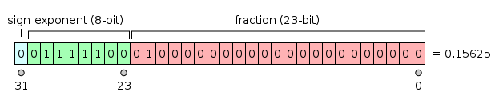
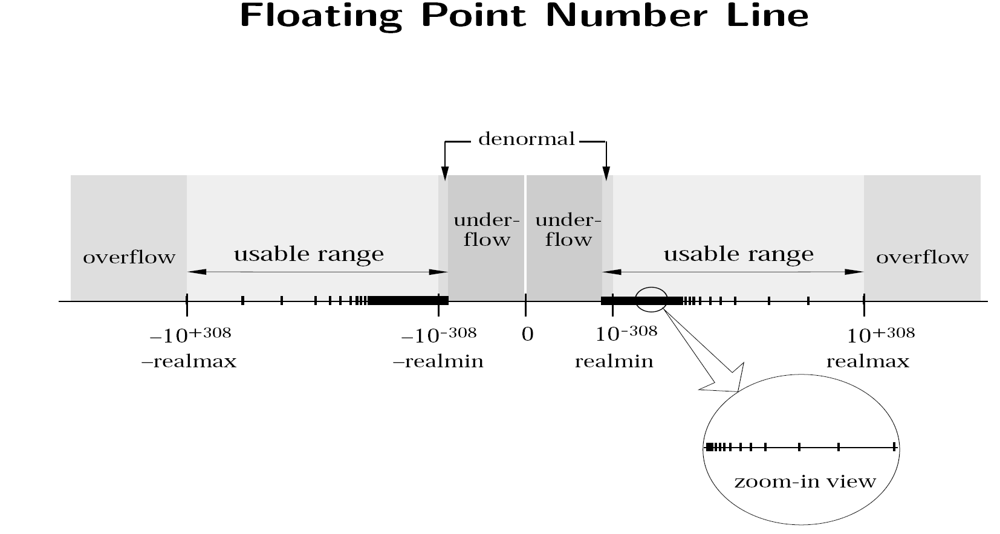
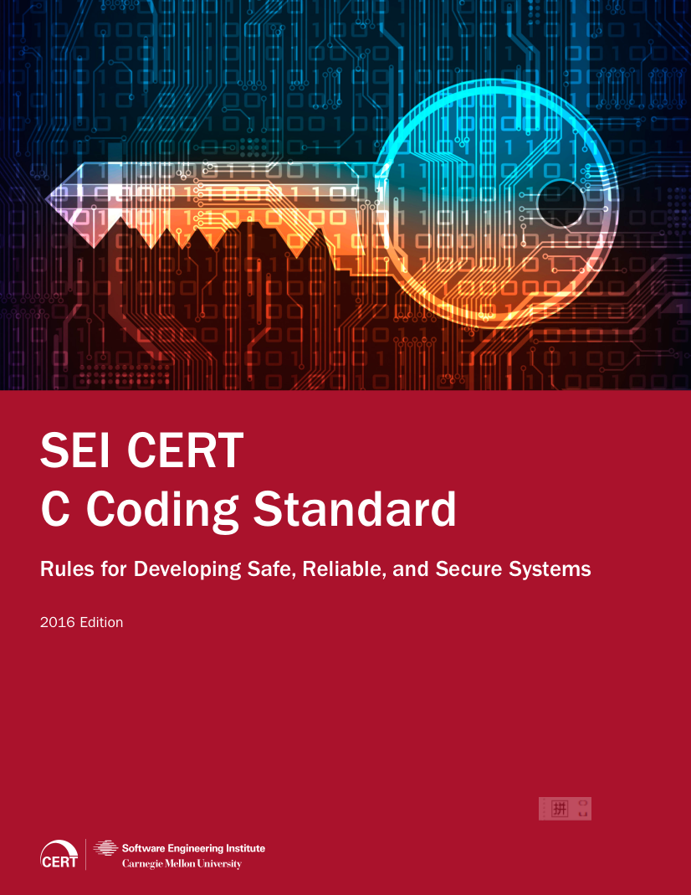

# 
7. &nbsp; Recursion; Data Types

[Hengfeng Wei (魏恒峰)](https://hengxin.github.io/)
hfwei@nju.edu.cn

Nov. 17, 2023

---
# Review

### Recursive Functions (Recursion)

---
# Overview
 
 

### Recursion (<mark>mergesort.c</mark>)
 

###  (Basic) Data Types

<!--  -->
<!--  -->

---
 
 
 
 

---

---

## <mark>mergesort.c</mark> (John von Neumann; 1945)

---
# Merge Sort (<mark>mergesort.c</mark>)

---
<!-- # Merge Sort (<mark>mergesort.c</mark>) -->

## DO YOU WANNA DANCE TONIGHT?

<!--  -->

---
# Data Types
 

The <mark>**type**</mark> of a variable determines

 

- the set of **values** it may take on and

- what **operations** can be performed on them.

---
 
 
 

## <mark>int &ensp;&ensp; char &ensp;&ensp; bool</mark>&ensp;&ensp;double
 

## <mark>[ ]</mark>

---
# Integral Types (<mark>int-limits.c</mark>)

 

<!-- ### <mark>Of different sizes</mark> -->
- short (int)

- int

- long (int)

- long long (int)

<!-- - int8_t &ensp; &int16_t &ensp; int32_t  &ensp; int64_t &ensp; (<mark>inttype.h</mark>) -->

---
# Signed and Unsigned (<mark>unsigned.c</mark>)
 
 
 

### <mark>Be careful when MIXING signed and unsigned types.</mark>
 

---
# Signed and Unsigned (<mark>unsigned.c</mark>)
 
 
 

### <mark>Do NOT use unsigned types unless you know exactly what you are doing.</mark>

---
# typedef
 
 

### <mark>typedef unsigned long long int size_t</mark>
 

### <mark>typedef long time_t</mark>

### <mark>#define _ _int64 long long</mark>

---
# char (<mark>char.c</mark>)
 
 

### Use `char` only for representing characters.
 

### Do NOT assume `signed char` or `unsigned char`.

---
# Overflow (<mark>int-overflow.c</mark>)
 
 

- <mark>有符号整数</mark>运算中发生溢出, 程序的行为是**未定义的**。
 

- <mark>无符号整数</mark>运算中没有溢出, 取而代之的是**回绕 (wrap)**现象。

---
# Implicit Conversion
### (<mark>implicit-conversion.c</mark>)
 

- 算术表达式、逻辑表达式 (<mark>先做整值提升; Section 7.4.3</mark>)

- 定义初始化、赋值 (类型转换)

- 函数调用时 (类型转换)

- 函数返回时 (类型转换)

### Be careful about narrowing conversions!!!

---
# Explicit Conversion
### (<mark>explicit-conversion.c</mark>)
 
 

#### <mark>(type) expression</mark>

---
# Floating-point Numbers
### (<mark>float-limits.c</mark>)
 

- float (F)

- double

- long double (L)

---

### <mark>"Floating-point Arithmetic is Hard."</mark>
#### (Section 23.1 `float.h`)

---
### <mark>"Many applications don't need floating-point arithmetic at all."</mark>

### Use `math.h` (Section 23.3) whenever possible.

---

$\approx 7 \qquad\qquad \approx 16$

---

---
 
 
 

## <mark>implicit-conversion.c</mark>
 

## <mark>sum-product.c &ensp; loop.c &ensp; compare.c**</mark>

---

---

---
