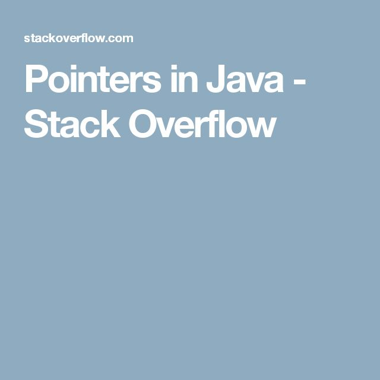

# 
8. &nbsp; Pointers (and Arrays)

[Hengfeng Wei (魏恒峰)](https://hengxin.github.io/)
hfwei@nju.edu.cn

Nov. 24, 2023

---
# Review
 

### Recursion (<mark>mergesort.c</mark>)
 

### Data Types

---
# Overview
 

### <mark>Pointers and Arrays</mark>

---
# Overview

 &emsp; 

---

## <mark>radius.c &emsp; selection-sort.c &emsp; ~~merge.c~~</mark>

---
# Variables (<mark>radius.c</mark>)
 
 

### A variable has its <mark>*type*</mark>, <mark>*value*</mark>, and <mark>*address*</mark>.
 

### A variable can be used as a <mark>*lvalue*</mark> or a <mark>*rvalue*</mark>.

---

"A <mark>***pointer***</mark> is a ***variable*** that
contains the ***address*** of a variable."

---
# Swap (<mark>selection-sort.c</mark>)
 

---
# Pointers and Arrays (<mark>selection-sort.c</mark>)
 

* In ***expressions***, the ***name*** of an array is a synonym for the <mark>***address of its first element***</mark>.
 

* But an array name is **NOT** a variable.

---
# Dynamic Memory Management (<mark>selection-sort.c</mark>)
 

### [void *malloc(size_t size);](https://en.cppreference.com/w/c/memory/malloc)
 

### [void free(void *ptr);](https://en.cppreference.com/w/c/memory/free)

---
# Returning Pointers from Functions (<mark>merge.c</mark>)

---
# Returning Multiple Values from Functions (<mark>scanf.c</mark>)
 

### <mark>while (scanf("%d", \&numbers[++len]) != EOF);
</mark>

---
