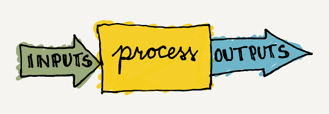

# 
1. &nbsp; Variables, Types, I/O

[Hengfeng Wei (魏恒峰)](https://hengxin.github.io/)
hfwei@nju.edu.cn

Sep. 27, 2024

---
# Review

**Program = Input + Data  + Operations + Output**

---
# Overview

### Variables (变量) &emsp; Data Types (数据类型)

 

### Operators (运算符) &emsp; Expressions (表达式)
### Assignment Statements (赋值语句)

 

### I/O (Input/Output; 输入输出)

---

## <mark>circle.c &ensp; sphere.c &ensp; mol.c</mark>
## <mark>admin.c &ensp; admin-scanf.c</mark>

---
# Circle

Given a **radius** (say $10$) of a circle,
to compute its **circumference** and **area**.

 

$L = 2\pi r$ &emsp; $S = \pi r^2$

 

- 每个结果各占一行
- 小数点后保留两位

---
# Declaration/Definition (声明/定义)
<code>int radius = 10;</code>

 

* <mark>Declare/Define</mark> a *variable* called `radius`.
* The <mark>type</mark> of `radius` is `int` (integer).
* `radius` is <mark>initialized</mark> to $10$.
* You can <mark>assign</mark> other integers to `radius`.
* `radius` refers to a <mark>location</mark> (`&radius`) in memory.

---
# Identifiers (标识符)

<code>int radius = 10;</code>

 

`radius` is an *identifier*.

**Warning:** Do *not* start with <code>_</code>, which are reserved by C.

 

#### Always use <mark>meaningful</mark> identifiers in a <mark>uniform</mark> style!!!

---
# <!-- fit --> Operators, Expressions, Assignment Statements

 
 
 

<code>circumference = 2 * PI * radius;</code>

---
# Sphere

Given a <mark>radius</mark> (say $100$) of a sphere,
to compute its <mark>surface area</mark> and <mark>volume</mark>.

$A = 4 \pi r^2\quad V = \frac{4}{3} \pi r^3$

- 每个结果占 $1$ 行
- 小数点后保留 $4$ 位
- 每个结果至少占 $15$ 字符, 左对齐
  - `_______________ : surface_area`
  - `_______________ : volume`

---
# mol
$6$ 克氧气的分子数是多少?

 

$Q = 6 / 32 \times 6.02 \times 10^{23}$

 

两种格式输出, 结果均使用<mark>科学计数法</mark>表示

- 第一行结果, 小数点后保留 $3$ 位
- 第二行结果, 保留 $5$ 位有效数字

---
# A (Naive) Administration System

 
 

- Name (EN)

- Gender (F/M)

- Birthday (mm-dd-yyyy)

- Weekday (Xyz.)

 

- C
- Music
- Medicine
 
- Mean (.d)
- Standard Deviation (.dd)
- Ranking ($\%$)

---

 

### For 罗大佑 only:
 

- 每组信息占一行
- 各项信息使用 `\t` 间隔
- 各项信息遵循特定格式要求

---
# <code>char</code> and <code><ctype.h></code>

A `char` is actually an `int`.

---
# <code>C string</code>
<code>char first_name[] = "Tayu";</code>

A C string is a null-terminated (`\0`) sequence of characters.

String literal: 'T', 'a', 'y', 'u', '\0'

 

* char first_name[5] = "Tayu";
* char first_name[10] = "Tayu";
* <del>char first_name[2] = "Tayu";</del>

---
### <mark>Conversion Specification</mark>
# <!--fit--> <code>%[flags][width][.[precision]]specifier</code>

- <code>%d</code>: decimal `int`
- <code>%f</code>: `double`
- <code>%e %E</code>: `double` ($-d.ddd \;\text{e} \pm dd$)
- <code>%c</code>: `char`
- <code>%s</code>: `C string`
- <code>%%</code>: `%`

---

 

It is <ins>up to you</ins> to ensure that the type of the actual argument <ins>matches</ins> the type expected by conversion specifiers.

[Undefined Behavior (UB)](https://en.cppreference.com/w/c/language/behavior)

---

### <mark>printf-error.c</mark>

---
# <!--fit--> <code>%[flags][width][.[precision]]specifier</code>

 
 
 

- $-$: left-justified (otherwise, right-justified)
- $+$: always begin with a plus or minus sign

---
# <!--fit--> <code>%[flags][width][.[precision]]specifier</code>

 
 

- minimum field width
- padded with spaces if it has fewer characters

---
# <!--fit--> <code>%[flags][width][.[precision]]specifier</code>

 
 

* `%d`: <mark>minimum number</mark> of digits
  - expanded with leading zeros when needed
* `%f`, `%e`, `%E`: <mark>number</mark> of digits after `.`
  - default is 6
* `%s`: <mark>maximum number</mark> of characters

---
 
 
 
 

# <!--fit-->[https://en.cppreference.com/w/c/io/fprintf](https://en.cppreference.com/w/c/io/fprintf)

---

### Section 7.21: `<stdio.h>`, P225--230

---

### Chapter 12: `<stdio.h>`, P257--262

---

---
# <code>%[$\ast$][width]specifier</code>

 

- <code>%d</code>: skip white-spaces; match a decimal `int`
- <code>%lf</code>: skip white-spaces; match a `double`
- <code>%c</code>: match a `char` (do <mark>NOT</mark> skip white-spaces)
- <code>%s</code>: match a sequence of non-white-spaces
- <code>%%</code>: mathch a `%`

---
# <code>%[$\ast$][width]specifier</code>

 
 

- $\ast$: assignment-suppressing

---
# <code>%[$\ast$][width]specifier</code>

 
 

- <mark>maximum</mark> field width to scan

---

### <mark>scanf-c17-ex2.c</mark>

---
 
 
 
 

# <!--fit--> [https://en.cppreference.com/w/c/io/fscanf](https://en.cppreference.com/w/c/io/fscanf)

---

### Section 7.21: `<stdio.h>`, P231--P237

---

### Chapter 12: `<stdio.h>`, P263--P268

---

### <mark>scanf-error.c</mark>

---
# <mark>stdin, stdout, stderr</mark>

### <mark>Input/Output Redirection</mark>

---
 

### [A beginners' guide away from `scanf`](http://sekrit.de/webdocs/c/beginners-guide-away-from-scanf.html)

 

# <!--fit--> Do NOT use `scanf`.

 

### [Why does everyone say not to use `scanf`? What should I use instead?](https://c-faq.com/stdio/scanfprobs.html)

---
