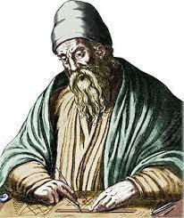

# 
13. &nbsp; Recursion

[Hengfeng Wei (魏恒峰)](https://hengxin.github.io/)
hfwei@nju.edu.cn

Dec. 27, 2024

---
### Recursive Functions (Recursion)

### A function that calls itself <mark>(min-re.c)</mark>.

---
# <mark> (1) Thinking like a Computer Scientist </mark>

You have a problem and suppose you have the <mark>Mirror</mark>.

#### The <mark>Mirror</mark> can solve smaller sub-problems for you <mark>magically</mark>.

---
# <mark> (1) Thinking like a Computer Scientist </mark>
 

* How to reduce the original problem into smaller sub-problems?
 

* How to solve the original problem given the solutions to the smaller sub-problems?
 

### What are the smaller sub-problems? &ensp; ($\star\star\star\star\star$)

---

## <mark>stairs.c</mark>

---

# <mark> (2) Thinking like a Computer</mark>

### How does <mark>the Mirror</mark> work? (<mark>stairs.c</mark>)

---
### What are the smallest sub-problems?

### <mark>Solve them without recursion!</mark>

---

### <mark>min-re.c &ensp; gcd-re.c &ensp; bsearch-re.c &ensp; mergesort.c</mark>

---
# Min (<mark>min-re.c</mark>)

<!--
---
# Fibonacci Sequence (<mark>fib-re.c</mark>)
 

$F_{0} = 0$

$F_{1} = 1$

$F_{n} = F_{n-1} + F_{n-2} \quad (n > 1)$
-->

---
# Greatest Common Divisor (<mark>gcd-re.c</mark>)

### $\text{gcd}(a, b) = \text{gcd}(b, a \;\%\; b)$

---
# Binary Search (<mark>bsearch-re.c</mark>)

<!-- You should do sth. first to obtain the smaller task. -->

---
# MergeSort (<mark>mergesort.c</mark>)

---

---

---
