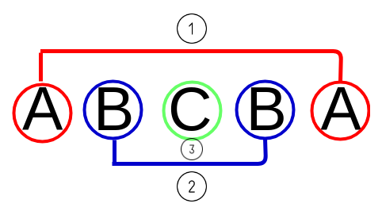

# 
3. &nbsp; For a While

[Hengfeng Wei (魏恒峰)](https://hengxin.github.io/)
hfwei@nju.edu.cn

Oct. 11, 2024

---
# Review
 

### If Statement (`if` 语句)
### For Statement (`for` 语句)
### Logical Expressions (逻辑表达式)

 

### Array (数组)

---
# Overview
 

### For Statement (More Examples)
 

### While (Do-While) Statement
 

### `break` Statement

---

## <mark>primes.c &ensp; binary-search.c &ensp; digits.c &ensp; selection-sort.c &ensp; palindrome.c</mark>

---
# Prime Numbers (`primes.c`)

---
# Binary Search (`binary-search.c`)

---
# <!-- fit --> Digits (`digits-while.c`, `digits-do-while.c`)

---
# Selection Sort (`selection-sort.c`)

---
# Palindrome (`palindrome.c`)

---
