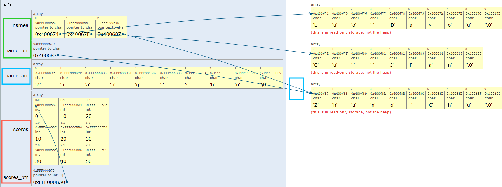

# 
9. &nbsp; Double Pointers

[Hengfeng Wei (魏恒峰)](https://hengxin.github.io/)
hfwei@nju.edu.cn

Nov. 29, 2024

---
# Review
 
 
 

## <mark>Pointers and C Strings</mark>

---
# Overview
 
 

## <mark>Pointer Arrays &emsp;(<code>char *names[]</code>)</mark>

## <mark>Pointers and 2D Arrays &emsp;(<code>int (*scores)[]</code>)</mark>

 

## Pointer Types Greatly Matter!!!

---

## <mark>selection-sort-strings.c</mark>
## <mark>scores.c &emsp; echo.c</mark>

---

---

---
