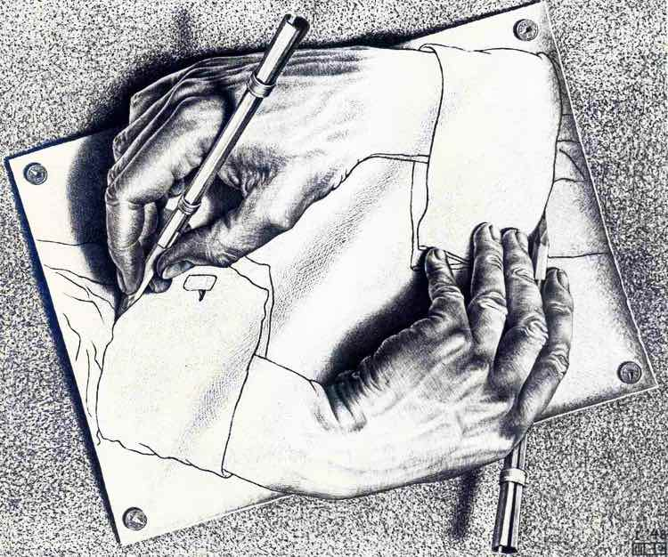
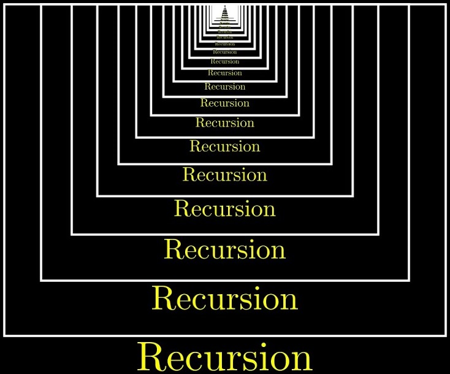

# 
13. &nbsp; Recursion

[Hengfeng Wei (魏恒峰)](https://hengxin.github.io/)
hfwei@nju.edu.cn

March 05, 2025

---
### Recursive Functions (Recursion)

### A function that calls itself <mark>(min-re.c)</mark>.

---
# <mark> (1) Thinking like a Computer Scientist </mark>

You have a problem and suppose you have the <mark>Mirror</mark>.

#### The <mark>Mirror</mark> can solve smaller sub-problems for you <mark>magically</mark>.

---
# <mark> (1) Thinking like a Computer Scientist </mark>
 

* How to <b>reduce</b> the original problem into smaller sub-problems?
 

* Recursively call the Mirror to solve these sub-problems
 

* How to <b>combine</b> the solutions to the smaller sub-problems into the solution to the original problem?
 

### What are the smaller sub-problems? &ensp; ($\star\star\star\star\star$)

---

## <mark>stairs.c</mark>

---

# <mark> (2) Thinking like a Computer</mark>

### How does <mark>the Mirror</mark> work? (<mark>stairs.c</mark>)

---
### What are the smallest sub-problems?

### <mark>Solve them without recursion!</mark>

---

### <mark>min-re.c &ensp; gcd-re.c &ensp; bsearch-re.c &ensp; mergesort.c</mark>

---
