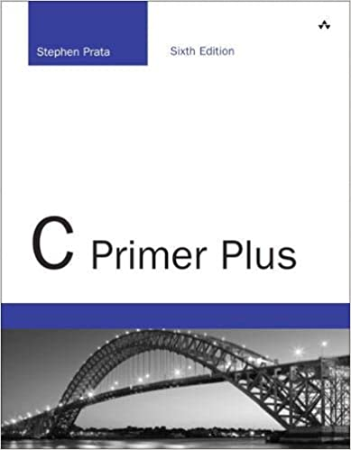
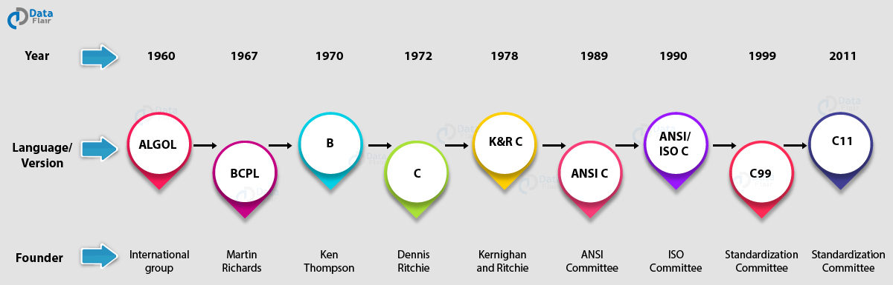

# 
0. &nbsp; Introducing C

[Hengfeng Wei (魏恒峰)](https://hengxin.github.io/)
hfwei@nju.edu.cn

Sep. 19, 2024

---

---
# Questionnaire (1)

<mark>$75\%$</mark> of students are new to programming.

---
# Questionnaire (2)

$10\%$ of students attended in some programming contests.

---
# Questionnaire (3)

### <mark>The C Beginners (know $0\%$)</mark>

---
# The C Beginners

---
# To The C Beginners

 

---
# From Beginners to Masters

 
 

## Programming

 

## De-Programming

---
## [cpl-docs @ docs.cpl.icu](http://docs.cpl.icu)

---
## [CPL Docs @ FeiShu](https://ymv59wdgrr.feishu.cn/wiki/A1HzwviAgiFnQwkfRUWcVjqunLf?from=from_copylink)

---
## [oj @ oj.cpl.icu; oj @ public.oj.cpl.icu](https://public.oj.cpl.icu/)

 

---
# [2024cpl @ Zulip](https://2024cpl.zulipchat.com/join/t4kpy6uj6ximq7k3qwve5smj/)

---
# Scores

* ~~考勤 (非必要不点名)~~

* 平时编程练习 ($10$ 分)
* 阶段机试 $1$ ($15$ 分)
* 阶段机试 $2$ ($20$ 分)
* 期末机试 ($30$ 分)
* 期末项目 ($25$ 分)

---
# No Plagiarism!!!

**编程练习**: 每次扣 $5$ 分, $10$ 分扣完为止; **期末项目**: 项目分数清零

---

### <mark>About the 2024CPL Class</mark>

---

---

---

---
# K&R C Bible (1978; 1988)

  

---
### [A Brief History of C @ cppreference](https://en.cppreference.com/w/c/language/history) **[[C17](https://en.cppreference.com/w/c/17); [C23](https://en.cppreference.com/w/c/23)]**

You do *NOT* need to be a **language lawyer**!

---

---

### <mark>More Books in the Class $\ldots$</mark>

---

---

---

<!-- ---

 -->

---

---

---
# [Game: Guess the Number](https://www.abcya.com/games/guess_the_number)

---
# [Game: Guess the Number](https://www.abcya.com/games/guess_the_number)

 

 

Programming is *NOT* (only) about languages.

 

You learn C to express <mark>**YOUR IDEAS**</mark> with **COMPUTERS**.

---
# [c reference](https://en.cppreference.com/w/c)

---
# [Game: Guess the Number](https://www.abcya.com/games/guess_the_number)

 

 

 

**Program = Input + Data  + Operations + Output**

---
# Secure Coding in C

 &nbsp;&nbsp;&nbsp;&nbsp; 

---

---

---
