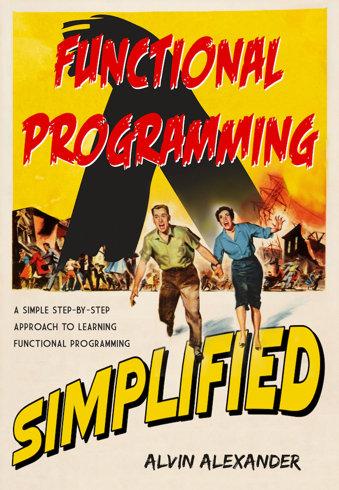
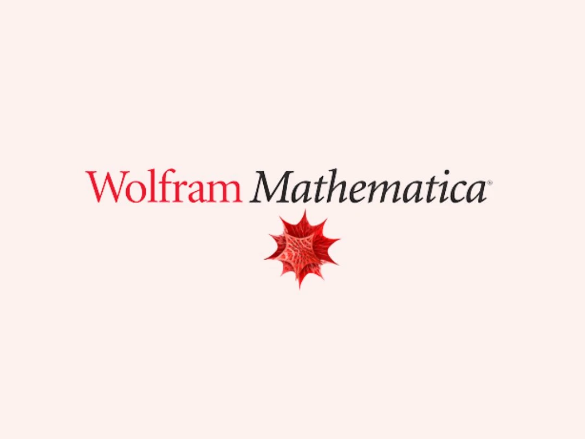

# 
10. &nbsp; Function Pointers

[Hengfeng Wei (魏恒峰)](https://hengxin.github.io/)
hfwei@nju.edu.cn

Dec. 06, 2024

---
# Review
 
 

## <mark>Pointer Arrays &emsp;(<code>char *musicians[]</code>)</mark>
 

## <mark>Pointers and 2D Arrays &emsp;(<code>int (*scores)[]</code>)</mark>

---
# Overview
 
 
 

# <mark>Function Pointers</mark>

---

## <mark>args&emsp; return vals &emsp; assignment &emsp; in array</mark>

---

## <mark>integrate.c &emsp; sort.c &emsp; bsearch.c</mark>

---
# $\int_{a}^{b}f(x)\text{d}x \approx \sum\limits_{i=0}^{n-1}f(x_{i})(\frac{b-a}{n})$
 
 

### $a = x_{0} < x_{1} < \cdots x_{i} < \cdots < x_{n-1} < x_{n} = b$
## $x_{i} = a + \frac{b-a}{n} \cdot i$

---
<!--  -->
 

&emsp;

---

## <mark>decl.c</mark>

---
