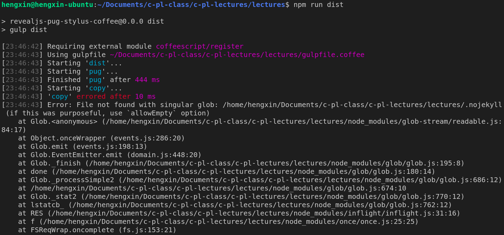

# c-pl-lectures

Lectures on the C Programming Language (CPL for short)

## How to View it?
### "Online" Mode
- Click [gh-pages](https://courses-at-nju-by-hfwei.github.io/c-pl-lectures/).

### "Offline" Mode
- `git clone git@github.com:courses-at-nju-by-hfwei/c-pl-lectures.git`
- Open `index.html` in your browse

For better display, in either mode, please [make sure](https://www.howtogeek.com/208552/how-to-change-the-default-fonts-in-your-web-browser/#:~:text=Changing%20Chrome's%20Font&text=Scroll%20down%20until%20you%20get,Done%E2%80%9D%20then%20restart%20your%20browser.) you choose an appropriate `monospace` font (especially for `<code>some code here</code>`) in your web browse.

## How to Play with it?
Please refer to [edemaine / reveal-pug-talk](https://github.com/edemaine/reveal-pug-talk).

## TODO
In the following years, I may try:

### Contents
- [ ] UI
- [ ] Macro

### Platforms
- [ ] [头歌](https://www.educoder.net/)
  - [ ] Chinasoft2022 程序设计教育论坛

### Tools

### Competitions
Lectures on the C Programming Language

## Help Me!!!

> It has been resolved; see [this issue](https://github.com/courses-at-nju-by-hfwei/c-pl-lectures/issues/1).
Thanks to [@52871299hzy](https://github.com/52871299hzy).

I failed to run `npm run dist` and `npm run deploy`, and got

Please let me know if you are able to resolve it.